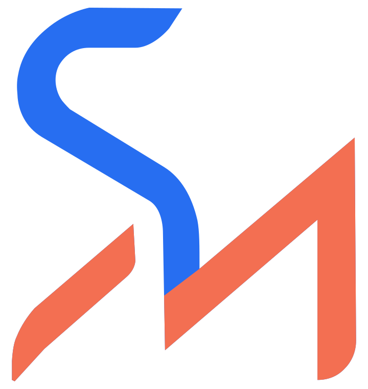

  <picture>
    <source media="(prefers-color-scheme: dark)" srcset="./assets/sm-lockup-dark.svg" />
    
  </picture>

<h1 align="center">Salim Al Mersally</h1>

<b>Senior software engineer | dependable systems, explained simply.</b>

---

### `About`

I build backend systems in Java and Spring Boot, currently working on a central-bank-licensed payment platform. Four years across distributed systems, microservices, and multi-tenant SaaS platforms.

### `Focus`

- Testing and observability built into the design, not bolted on after
- Distributed, event-driven systems with real tenant isolation
- Bringing safe, incremental testing to legacy codebases that didn't have it
- Mentoring engineers and facilitating delivery across multiple teams

### `Skills`

**Languages**

**Frameworks**

**Cloud & Infrastructure**

**Testing & Observability**

**Practices**

`Microservices` `Distributed Systems` `CI/CD` `TDD` `DDD` `Agile`

---

### `Find me`

 Portfolio & writing — [salimalmersally.com](https://salimalmersally.com)

💼 LinkedIn — [linkedin.com/in/salim-al-mersally](https://linkedin.com/in/salim-al-mersally)

📸 Instagram — [@built.by.salim](https://instagram.com/built.by.salim)

🐙 GitHub — you're already here
